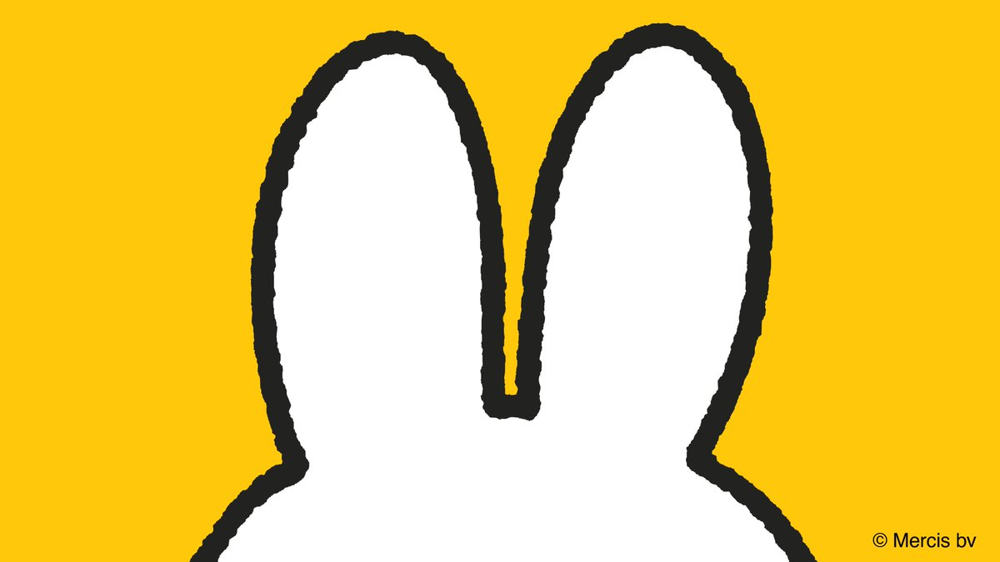

# vector-sketch
A love2d based drawing tool, to make simple flat shaded figures with a bit of a rough outline.

> Wist je dat #DickBruna's illustraties met een penseel zijn getekend? Hierdoor ontstaat de kenmerkende 'bibber' in de lijnen! #nijntje
> Did you know that # DickBruna's illustrations are drawn with a brush? This creates the characteristic 'shake' in the lines! #miffy
> # DickBruna의 일러스트레이션이 브러시로 그려져 있다는 것을 알고 있습니까? 이것은 라인에 특징적인 '흔들림'을 만듭니다! # 미피
> 您是否知道＃DickBruna的插圖是用筆刷繪製的？這會在線條中產生特徵性的“抖動”！ ＃米菲
> Знаете ли вы, что иллюстрации # DickBruna нарисованы с помощью кисти? Это создает характерное «дрожание» в линиях! #miffy

